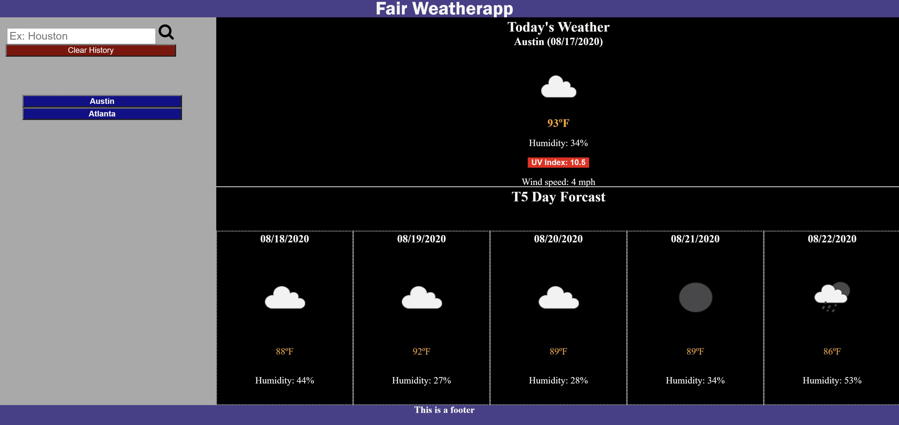
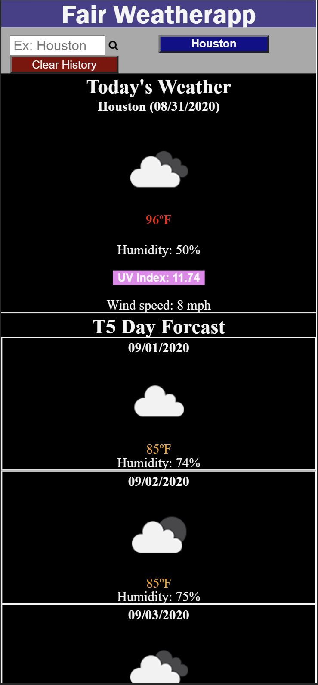

Homework #6: Weather Dashboard by Cristino Perez (https://github.com/cperez525)

Repository URL: https://github.com/cperez525/weather_dashboard

Deployed App URL: https://cperez525.github.io/weather_dashboard/

Weather forcasts have never been easier to get than with the Fair Weatherapp! Just search a city and instantly get the current weather and 5 day forcast. On a trip? Visiting multiple cities? The Fair Weatherapp will save multiple searched cities so that you can easily navigate back to the forcasts for your saved cities! Weather you're traveling or just wanting your hometown's weather, the Fair Weatherapp is your perfect weather forcast solution!

This app was developed using HTML, CSS, Javascript, and jQuery.

Screenshots:

1) Weather Dashboard Page:  
2) Weather Dashboard Page:  